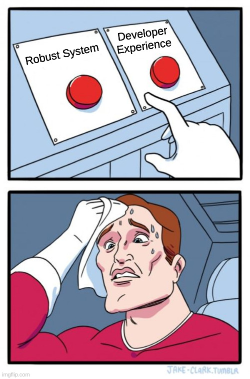
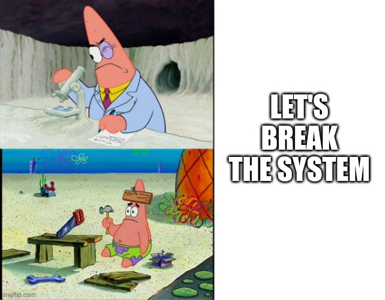
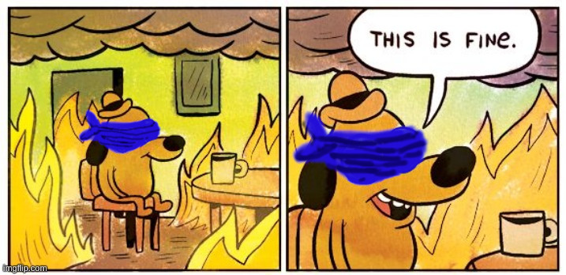
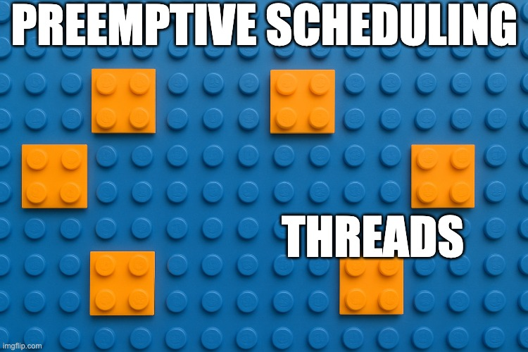
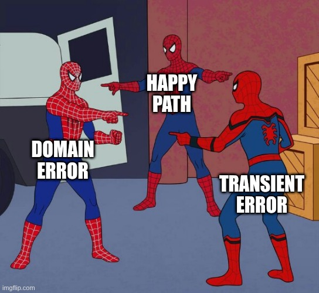

<!-- Use external markdown resource, separate slides by three newlines; vertical slides by two newlines -->
## Let it Crash
----
### Designing Robust Systems

Note:
00:00 Freddy
- Prep: Tail logs, remote console, load control 0, reset board to default
- Marcus, Freddy
- Original title: 'Your stack is too damn complex - Let it crash with Elixir'
- Show you why letting 'it' crash might be a good thing.

Note:
01:00
- Show of hands: Who needs this?
- Sounds pretty unspecific, no?
- Let's zoom in

### A robust system
- runs despite errors
- performant despite errors
- treats users fairly

- Heisenbugs <!-- .element: class="fragment" data-fragment-index="1" -->
- self-healing <!-- .element: class="fragment" data-fragment-index="1" -->

Note:
02:00
- graceful degradation
- low support and operational costs

### Use cases
- High availability
- Simple tech stack
- Start ups

Note:
03:40
- simple tech stack: not language: infrastructure and ops
- start up: resources constraints, scalable

Note:
04:00
- developer experience: low mental load, less moving parts
- ease of deployment, monitoring, tracing

bugs and high load 🐞

Note:
05:00
- <a target="_blank" href="https://console.hetzner.com/projects/11266407/servers/103367032/overview">Hetzner</a>
- <a target="_blank" href="https://ftes.de/owl">ftes.de/owl</a>
- walk through web UI
  - user facing input
  - <a target="_blank" href="https://dcon-elixir.ftes.de/dashboard/load_control">load control dashboard</a>
    - 100_000
    - scheduler load, <a href="https://console.hetzner.com/projects/11266407/servers/103367032/graphs">Hetzner graph</a>
- all running in single OS process

### How would You build it?
<!-- qrencode -o img/qrcode-board-building-blocks.png https://dcon-elixir.ftes.de/board/building-blocks -->

[ftes.de/owl](https://ftes.de/owl)
Note:
09:00 Marcus
- What building blocks would you need?
- Especially given the hardware constraints we've imposed
- 🌐 Show <a target="_blank" href="https://dcon-elixir.ftes.de/board/building-blocks">board 1</a>
- <a target="_blank" href="https://dcon-elixir.ftes.de/board/building-blocks/admin">admin view</a>

<a href="https://ftes.de/owl" target="_blank">ftes.de/owl</a>
Note:
13:00
- your turn: find 3 bugs
  - negative
  - 13
  - large numbers
- wait until all are found
- demonstrate for everyone to see

### Observability

Note:
16:00

### What are Your tools?
<!-- qrencode -o img/qrcode-board-observability.png https://dcon-elixir.ftes.de/board/observability -->

[ftes.de/owl](https://ftes.de/owl)
Note:
16:30
- <a target="_blank" href="https://dcon-elixir.ftes.de/board/observability/admin">board 2 admin view</a>
- How can you find a 'misbehaving part of software' on PROD?
- Follow-Up: How do you partition software in your stack?

Note:
20:00 Freddy
- keep your browser windows open!
- `mirror`
- edge case 13: error in log -> fix `math.ex`
- negative number -> fix `web/math.ex`
- large numbers
  - <a target="_blank" href="https://dcon-elixir.ftes.de/dashboard/processes?limit=50&search=&sort_by=reductions_diff&sort_dir=desc">Processes dashboard</a>
  - `pid = pid(0, 302790, 0)`
  - `Runtime.top()`
  - `Runtime.trace(pid)`
  - `Runtime.stacktrace(pid)`
  - `Runtime.kill_math()`
- deploy: `scripts/upgrade.sh`

### Building Blocks

### for Robustness

Note:
25:00 Marcus, ad lib
- What primitives must the runtime provide to enable this?

Note:
25:30
- threads: lightweight, isolated, identity
- preemptive scheduling
- memory isolation & message passing
- threads have and identity -> introspection

## Supervision trees

Note:
28:00
- process supervision (via message system)

  <h3 class="fragment">Let it crash</h3>
  <h3 class="fragment">...and heal itself</h3>

Note:
30:00
- fragility on the micro-scale often means robustness on the macro scale
- Supervision-tree:
  - restart subsystem that got affected by a non user-facing error

Note:
32:00 Marcus

### Reducing Complexity

Note:
32:30
- complex -> to complect
- there are errors that are relevant to the user
- and errors that are irrelevant to the user
- Why do both types of errors need to be complected?

Note:
34:00 Freddy

## Processes
- isolated
- introspectable
- distributed

Note:
34:30

## Let it Crash
- compact
- loud
- self-healing

Note:
36:00
- let it crash: assert expected state

## Uniformity

- simple tech stack
- dev, test, deploy, ops

<small>

- background jobs
- distributed cache
- crash recovery
- remote shell
- monitoring
- rich web UI
- cluster

</small>

Note:
37:00

## Other Benefits
- telemetry + shell
- SSR + WebSocket + DOM patching = ✅

Note:
38:00

Note:
39:00

<!-- .slide: data-background-image="img/bogengaudi.avif" class="orange" -->
## BogenGaudi

### Rent by 📦

---

#### Marcus Autenrieth
[marcus@autenrieth.me](mailto:marcus@autenrieth.me)

#### Fredrik Teschke
[ftes.de](https://ftes.de)

